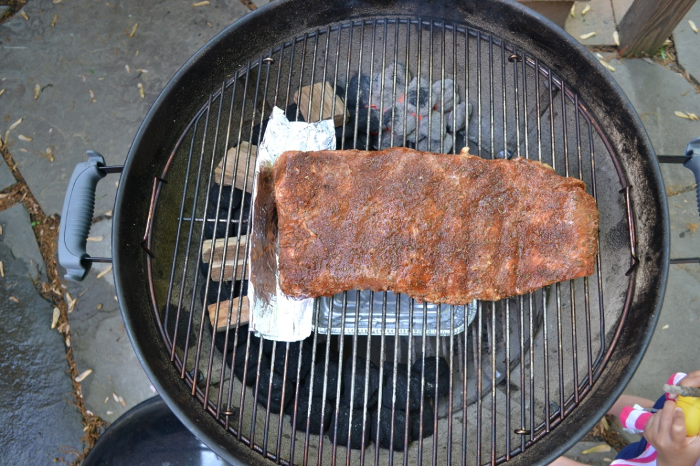

# Attempt at slow cooking ribs on a kettle grill using the charcoal snake method.

After seeing a bunch of YouTube videos on how to slow cook meat on the grill using the snake method, I have been eager to give it a try. This is my first attempt using pork spare ribs. I didn't prepare the rub or the mixture used for basting the ribs.

## 0720 Hours - Grill prep

* Lit the starter coals.
* Heated up some water for the pan.
* Arranged the charcoal and wood chips.

## 0745 Hours - Preheat

* Added the starter coals.
* Added a pan with hot water.
* Covered the grill and waited for it to get to a good temperature (225-275 degrees F).

## 0807 Hours - Meat on grill

* Put heat shield and ribs on the grill.
* Grill was around 220 degrees.

## 0850 Hours

* Grill at 250 degrees.

## 0911 Hours

* Grill at 285 degress.
* Closed exhaust vent to 50%.

## 0924 Hours

* Opened exhaust vent to 100%.
* Closed intake vent to 50-60%.

## 0946 Hours - Too hot!

* Grill was at 290 degrees. Closed the intake vent to about 25%.

## 1006 Hours

* Grill at 250 degrees.
* Closed exhaust to 50%. This will trap the smoke, right?

## 1115 Hours

* Grill at 230 degrees.
* Unblocked the intake vent. Ash from the charcoal fell, partially blocking the intake vent.

## 1140 Hours

* Grill at 260 degrees.
* Very slightly closed the intake vent.

## 1158 Hours

* Grill is still at 260 degrees.

## 1200 Hours - Basting time

* Checked and basted the ribs.
* About 85% of the charcoals on the bottom row were already started. Is it burning too fast?

## 1212 Hours

* Grill at 265 degrees.
* Slightly closed the intake vent.

## 1232 Hours

* Grill at 260 degrees.
* Closed the exhaust vent to 25%. (I should really stop fiddling with the vents.)

## 1253 Hours

* Grill at 250 degrees.
* Basted the meat.

## 1326 Hours

* Grill at 225 degrees.
* Had to unblock the fallen ash from the intake vent again.
* Opened up the intake vent slightly.
* Opened the exhaust vent to 50%.

## 1342 Hours

* Grill at 220 degrees.
* Basted the meat.

## 1356 Hours

* Grill at 218 degrees.
* Fully opened the exhaust vent.
* Opened the intake vent to 50%.

## 1406 Hours

* Grill at 210 degrees.
* Fully opened the intake vent.

## 1420 Hours

* Grill at 195 degrees.
* Added more coals to the snake...wasn't sure if they would catch at this point.

## 1444 Hours

* Grill at 200 degrees.
* Basted the meat.

## 1507 Hours

* Grill at 265 degrees.
* Closed intake vent to 30-40%.

## 1529 Hours

* Grill at 225 degrees.
* Basted the meat.

## 1615 Hours - Done!

* Grill at 160 degrees.

* Overall, the ribs were pretty good. Not life changing, but good. Lots of flavor, but not as tender as I expected (but not too chewy either). I don't have any good criticism yet. I probably will after my 2nd try and have something to compare it to.

## Lessons Learned / Things to try differently next time

* Allow more time for the starter coals to get hot.

I was in a rush and needed to get my daughter to school, but wanted to get the ribs on the grill first. The starter coals could have used more time to heat up.

* Leave the exhaust vent fully open and regulate the temperature using intake vent.

I tried adjusting both at various times to get the temperature where I wanted, but in the end I don't know what settings really worked. Next time keep it simple and only adjust one.

* Get the temperature stable before throwing on the meat.

The grill got really hot at the very beginning. Next time I would like to get it to a stable, low temperature and try to maintain the low temperature from the start.

* Use a longer snake.

I arranged the snake to go halfway around the grill hoping that it would last 8 hours, but it only lasted 6 1/2. It was awkward trying to add more coals at that point. Make the snake longer, just in case.

* Orient the grate to easily allow more charcoal to be added, if necessary.

The grate on my grill opens up on two sides, but I had place the ribs in a position that made it awkward for opening. Orient the grate and the meat so that the grate can be opened and charcoal can be dropped in without any fuss.

